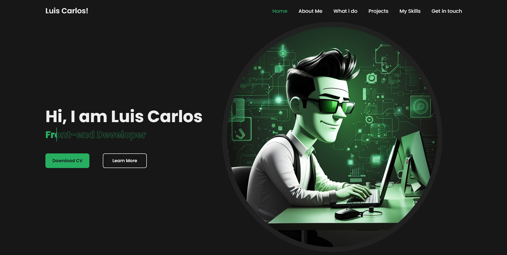

<h1 align="center">
  💻 Projeto Portfólio
</h1>

<h4 align="center"><a href="https://portfolio-project-chi-lake.vercel.app" target="_blank">Clique para visitar o projeto</a></h4>

## 📚 Seções

O site é composto por seis seções:

- *Home:* Nele temos uma breve apresentação;
- *About me:* Nessa seção tenho uma descrição dizendo um pouco sobre o que eu estou buscando;
- *What i do:* Mostro alguns serviços na área de desenvolvimento e design;
- *Projects:* Apresenta alguns projetos desenvolvidos e com link direto para eles no Vercel;
- *My skills:* Apresenta algumas de minhas habilidades e o quanto domino cada uma;
- *Get in touch:* Um pequeno formulario para entrar em contato;

---

## 💼 Tecnologias utilizadas

Para o desenvolvimento deste site utilizei as seguintes tecnologias:

- HTML;
- CSS;
- JavaScript;
- Boxicons;

---
